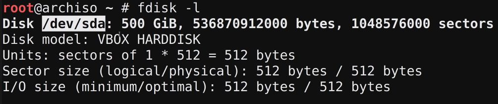

# Arch Linux Install

This guide starts after booting up the .iso image.

**Before you begin any of the steps make sure you have an internet connection**

## Initial Setup

Once you have confirmed that an internet connection is present. Run the following commands
to install git and bash:

```
pacman -Syy
pacman -S bash
pacman -S git
```

Next pull this repository to into archiso using the following command:

```
git clone https://gitlab.com/fahmed8383/arch-linux-install.git
```

Next we want to make all the following scripts executable. To do this run the following commands:

```
cd arch-linux-install
chmod u+x ./disk-setup-uefi
```

Now you have access to neccesary scripts to install arch linux according to this guide. We can
start by setting up the disks using the appropriate script in the next step.

## Setting Up Disks

Make sure you are running these scripts on an empty disk or partition. All data on the disk that
these scripts are run on will be lost.

**Currently this guide only has the scripts for setting up the disks for uefi environments**

### UEFI

To be able to run this script we need to know our disk name and the amount of GB we want to allocate
to the root logical volume. You should allocate atleast 10GB to root and I would recommend 30GB
if you have the disk space.

Use the fdisk -l command to get your disk name. In the image below the diskname would be /dev/sda



Once you know the your diskname and the amount of storage you want to allocate to root, 
run the command as shown in the below example (diskname is diskname and 30 is the amount of GB
we want to allocate to root).

```
./disk-setup-uefi diskname 30
```

